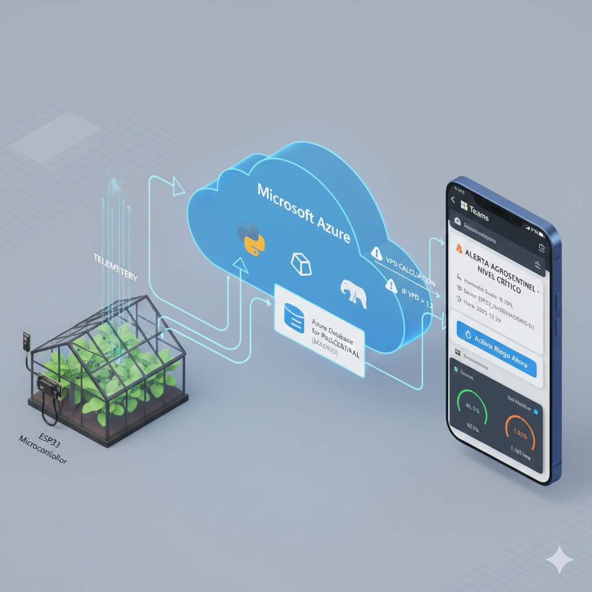

cat <<EOF > README.md
# 🌾 AgroSentinel v1.3: Sistema de Inteligencia Climática & IoT

> **Estado:** 🟢 Estable (Release v1.3)
> **Stack:** Python + Docker + TimescaleDB + Grafana
> **Ciencia:** Cálculo de VPD (Fórmula de Tetens) & Punto de Rocío
> **Desarrollador:** El Mostapha Jaidi | Ingeniero Agro-Tech & Biólogo

---

## 💡 ¿Qué es AgroSentinel?
**AgroSentinel** es un ecosistema de monitorización agrícola diseñado para **transformar datos climáticos en decisiones biológicas**.
A diferencia de estaciones meteorológicas simples, este sistema no solo dice "hace calor", sino que diagnostica **cómo se siente la planta**.

### 🧬 Nueva Lógica Agronómica (v1.3)
El sistema procesa las variables crudas y calcula indicadores de fisiología vegetal en tiempo real:

1.  **💧 VPD (Déficit de Presión de Vapor):**
    * Calculado matemáticamente para medir la capacidad de transpiración.
    * **< 0.4 kPa:** Riesgo de hongos (Botrytis).
    * **0.8 - 1.2 kPa:** Zona Óptima de Crecimiento.
    * **> 1.6 kPa:** Estrés hídrico (Cierre de estomas).
2.  **🌫️ Punto de Rocío (Dew Point):**
    * Alerta temprana de condensación de agua en hoja (riesgo de infección fúngica).

---

## 🚀 Arquitectura "Rock-Solid"
Diseñado para el **Edge Computing** (funciona en hardware reciclado o servidores modestos):

* **🧠 AgroBot (Python):** Ingesta de datos asíncrona y tolerante a fallos.
* **⏱️ TimescaleDB:** Base de datos SQL optimizada para series temporales masivas.
* **📊 Grafana:** Visualización profesional con alertas semafóricas (Ver captura).
* **🐳 Docker:** Orquestación completa. Despliegue en 1 comando.

---

## 🛠️ Instalación Rápida

### 1. Clonar y Configurar
\`\`\`bash
git clone https://github.com/jaaidi0/AgroSentinel.git
cd AgroSentinel
cp .env.example .env
# (Opcional) Edita .env con tus credenciales
\`\`\`

### 2. Desplegar el Cerebro (Docker)
\`\`\`bash
docker compose up -d --build
\`\`\`

### 3. Cargar el Dashboard Visual
El diseño profesional ya está incluido en este repositorio.
1.  Abre Grafana en \`http://localhost:3000\` (User: admin / Pass: admin).
2.  Ve a **Dashboards** > **New** > **Import**.
3.  Sube el archivo \`grafana_dashboard_v1.3.json\` incluido en esta carpeta.
4.  ¡Listo! Verás los medidores de VPD y Clima al instante.

---

## 🌿 Código con Raíces Científicas
Este proyecto demuestra cómo la **Ingeniería de Datos** puede resolver problemas reales de la **Biología Vegetal**.

*Hecho con código, clorofila y hardware reciclado.* ♻️
EOF